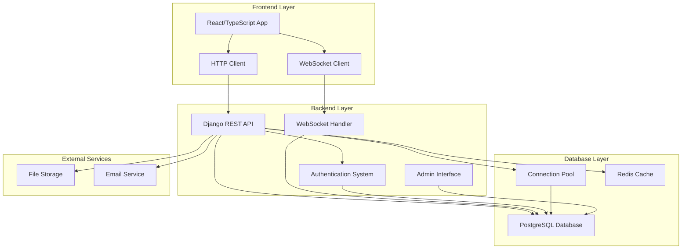

# Django + PostgreSQL Enhancement Design Document

## Overview

This design document outlines the comprehensive enhancement of the existing Django blog application by migrating from SQLite to PostgreSQL and implementing robust backend functionality with seamless frontend integration. The enhancement will transform the current blog into a production-ready system with advanced features, real-time synchronization, and scalable architecture.

The design maintains the existing Django REST framework structure while adding PostgreSQL-specific optimizations, real-time capabilities, comprehensive API coverage, and enhanced security measures.

## Architecture

### High-Level Architecture



### Component Architecture

The system follows a layered architecture with clear separation of concerns:

1. **Presentation Layer**: React frontend with TypeScript
2. **API Layer**: Django REST Framework with comprehensive endpoints
3. **Business Logic Layer**: Django models and services
4. **Data Access Layer**: PostgreSQL with optimized queries
5. **Caching Layer**: Redis for performance optimization
6. **Real-time Layer**: WebSocket connections for live updates

## Components and Interfaces

### Backend Components

#### 1. Enhanced Models
- **CustomUser**: Extended user model with PostgreSQL-optimized fields
- **Article**: Enhanced with PostgreSQL full-text search and indexing
- **Comment**: Improved with threading and moderation features
- **Category/Tag**: Optimized with PostgreSQL-specific constraints
- **Analytics**: New models for tracking and reporting

#### 2. API Endpoints
- **Public API**: Read-only endpoints for public content
- **Authenticated API**: User-specific operations
- **Admin API**: Administrative operations with enhanced permissions
- **Real-time API**: WebSocket endpoints for live updates

#### 3. Authentication System
- **JWT Authentication**: Enhanced token management
- **Permission System**: Role-based access control
- **Session Management**: Secure session handling

#### 4. Real-time System
- **WebSocket Handler**: Django Channels for real-time communication
- **Event Broadcasting**: Automatic updates for content changes
- **Connection Management**: Efficient WebSocket connection handling

### Frontend Integration Points

#### 1. HTTP API Integration
```typescript
interface APIClient {
  articles: ArticleAPI;
  comments: CommentAPI;
  auth: AuthAPI;
  admin: AdminAPI;
  realtime: RealtimeAPI;
}
```

#### 2. WebSocket Integration
```typescript
interface WebSocketEvents {
  'article:created': (article: Article) => void;
  'article:updated': (article: Article) => void;
  'comment:created': (comment: Comment) => void;
  'user:authenticated': (user: User) => void;
}
```

#### 3. State Management
- **Redux/Context**: Centralized state management
- **Real-time Sync**: Automatic state updates from WebSocket events
- **Optimistic Updates**: Immediate UI updates with rollback capability

## Data Models

### Enhanced PostgreSQL Schema

#### User Model Enhancements
```sql
-- Enhanced user table with PostgreSQL features
CREATE TABLE blog_customuser (
    id UUID PRIMARY KEY DEFAULT gen_random_uuid(),
    username VARCHAR(150) UNIQUE NOT NULL,
    email VARCHAR(254) UNIQUE NOT NULL,
    password VARCHAR(128) NOT NULL,
    first_name VARCHAR(30),
    last_name VARCHAR(150),
    title VARCHAR(10),
    bio TEXT,
    user_type VARCHAR(10) DEFAULT 'normal',
    avatar_url TEXT,
    preferences JSONB DEFAULT '{}',
    location POINT,
    timezone VARCHAR(50),
    last_active TIMESTAMP WITH TIME ZONE DEFAULT NOW(),
    is_active BOOLEAN DEFAULT TRUE,
    is_staff BOOLEAN DEFAULT FALSE,
    is_superuser BOOLEAN DEFAULT FALSE,
    date_joined TIMESTAMP WITH TIME ZONE DEFAULT NOW(),
    
    -- PostgreSQL-specific indexes
    CONSTRAINT valid_user_type CHECK (user_type IN ('admin', 'normal', 'guest'))
);

CREATE INDEX idx_user_email_gin ON blog_customuser USING gin(email gin_trgm_ops);
CREATE INDEX idx_user_location ON blog_customuser USING gist(location);
CREATE INDEX idx_user_preferences ON blog_customuser USING gin(preferences);
```

#### Article Model Enhancements
```sql
-- Enhanced article table with full-text search
CREATE TABLE blog_article (
    id UUID PRIMARY KEY DEFAULT gen_random_uuid(),
    title VARCHAR(255) NOT NULL,
    slug VARCHAR(255) UNIQUE NOT NULL,
    excerpt TEXT,
    content TEXT NOT NULL,
    content_vector tsvector,
    image_url TEXT,
    read_time INTEGER,
    author_id UUID REFERENCES blog_customuser(id),
    category_id UUID REFERENCES blog_category(id),
    status VARCHAR(20) DEFAULT 'draft',
    views INTEGER DEFAULT 0,
    likes INTEGER DEFAULT 0,
    featured BOOLEAN DEFAULT FALSE,
    scheduled_publish TIMESTAMP WITH TIME ZONE,
    created_at TIMESTAMP WITH TIME ZONE DEFAULT NOW(),
    updated_at TIMESTAMP WITH TIME ZONE DEFAULT NOW(),
    published_at TIMESTAMP WITH TIME ZONE,
    
    -- Full-text search
    CONSTRAINT valid_status CHECK (status IN ('draft', 'published', 'archived'))
);

-- Full-text search indexes
CREATE INDEX idx_article_content_search ON blog_article USING gin(content_vector);
CREATE INDEX idx_article_title_search ON blog_article USING gin(to_tsvector('english', title));
CREATE INDEX idx_article_published ON blog_article (published_at DESC) WHERE status = 'published';
```

#### Comment Model Enhancements
```sql
-- Enhanced comment table with threading
CREATE TABLE blog_comment (
    id UUID PRIMARY KEY DEFAULT gen_random_uuid(),
    article_id UUID REFERENCES blog_article(id) ON DELETE CASCADE,
    author_id UUID REFERENCES blog_customuser(id),
    parent_id UUID REFERENCES blog_comment(id),
    content TEXT NOT NULL,
    content_vector tsvector,
    ip_address INET,
    user_agent TEXT,
    approved BOOLEAN DEFAULT FALSE,
    is_flagged BOOLEAN DEFAULT FALSE,
    moderation_notes TEXT,
    created_at TIMESTAMP WITH TIME ZONE DEFAULT NOW(),
    updated_at TIMESTAMP WITH TIME ZONE DEFAULT NOW(),
    
    -- Prevent deep nesting
    CONSTRAINT max_nesting_level CHECK (
        CASE WHEN parent_id IS NULL THEN TRUE
        ELSE (SELECT COUNT(*) FROM blog_comment c WHERE c.id = parent_id) < 5
        END
    )
);

CREATE INDEX idx_comment_thread ON blog_comment (article_id, parent_id, created_at);
CREATE INDEX idx_comment_moderation ON blog_comment (approved, is_flagged, created_at);
```

### Migration Strategy

#### SQLite to PostgreSQL Migration
1. **Schema Migration**: Convert SQLite schema to PostgreSQL with enhancements
2. **Data Migration**: Transfer all existing data with integrity checks
3. **Index Creation**: Add PostgreSQL-specific indexes for performance
4. **Constraint Addition**: Implement PostgreSQL constraints and validations

## Correctness Properties

*A property is a characteristic or behavior that should hold true across all valid executions of a system-essentially, a formal statement about what the system should do. Properties serve as the bridge between human-readable specifications and machine-verifiable correctness guarantees.*

### API and Data Integrity Properties

**Property 1: Article API pagination consistency**
*For any* article list request, the API response should include pagination metadata (page, total_pages, count) and the returned articles should match the requested page parameters
**Validates: Requirements 1.1**

**Property 2: Article completeness**
*For any* article retrieval request, the response should include all related comments and tags associated with that article
**Validates: Requirements 1.2**

**Property 3: Category hierarchy organization**
*For any* category browsing request, the returned data should maintain proper hierarchical relationships and organization
**Validates: Requirements 1.3**

**Property 4: Search result relevance**
*For any* search query, all returned articles should contain the search terms in their title, content, or associated metadata
**Validates: Requirements 1.4**

### Authentication and Security Properties

**Property 5: Secure user registration**
*For any* user registration, the stored password should be properly hashed and never stored in plain text
**Validates: Requirements 2.1**

**Property 6: JWT token validity**
*For any* successful login, the returned JWT token should be valid, properly signed, and contain correct user claims
**Validates: Requirements 2.2**

**Property 7: Profile update validation**
*For any* profile update request, invalid data should be rejected with appropriate error messages, and valid data should be stored correctly
**Validates: Requirements 2.3**

**Property 8: Comment association integrity**
*For any* comment creation, the comment should be properly associated with both the user account and the target article
**Validates: Requirements 2.4**

**Property 9: Token refresh security**
*For any* token refresh operation, expired tokens should be properly handled and new tokens should maintain security standards
**Validates: Requirements 2.5**

### Administrative Properties

**Property 10: Admin article creation completeness**
*For any* article created by an administrator, all provided metadata (categories, tags, status) should be properly stored and retrievable
**Validates: Requirements 3.1**

**Property 11: User administration functionality**
*For any* user management operation by an administrator, the changes should be applied correctly and reflected in subsequent queries
**Validates: Requirements 3.2**

**Property 12: Comment moderation workflow**
*For any* comment moderation action (approve, flag, delete), the comment state should change appropriately and persist correctly
**Validates: Requirements 3.3**

**Property 13: Settings persistence**
*For any* blog configuration change, the settings should be stored in PostgreSQL and retrievable in subsequent requests
**Validates: Requirements 3.4**

**Property 14: Analytics accuracy**
*For any* analytics calculation, the reported metrics should accurately reflect the underlying data patterns
**Validates: Requirements 3.5**

### Migration Properties

**Property 15: Migration data preservation**
*For any* SQLite to PostgreSQL migration, all original data should be present in the PostgreSQL database after migration
**Validates: Requirements 4.1**

**Property 16: Schema conversion correctness**
*For any* data type conversion during migration, SQLite types should be properly mapped to equivalent PostgreSQL types
**Validates: Requirements 4.2**

**Property 17: Relationship preservation**
*For any* foreign key relationship in SQLite, the equivalent relationship should be maintained in PostgreSQL after migration
**Validates: Requirements 4.3**

**Property 18: Migration verification accuracy**
*For any* completed migration, the verification report should accurately reflect the success or failure of data transfer
**Validates: Requirements 4.4**

**Property 19: Migration rollback integrity**
*For any* migration rollback operation, the system should return to the original SQLite state without data corruption
**Validates: Requirements 4.5**

### Database and Performance Properties

**Property 20: Backup and restore integrity**
*For any* backup and restore operation, the restored data should be identical to the original data
**Validates: Requirements 5.2**

**Property 21: Monitoring data accuracy**
*For any* system operation, the generated performance metrics and logs should accurately reflect the actual system behavior
**Validates: Requirements 5.4**

### Frontend Integration Properties

**Property 22: API response consistency**
*For any* CRUD operation on articles, comments, categories, or tags, the response format should be consistent and include all required fields
**Validates: Requirements 6.1**

**Property 23: Authentication integration**
*For any* authenticated API request, the token should be properly validated and user context should be correctly established
**Validates: Requirements 6.2**

**Property 24: Validation error handling**
*For any* invalid data submission, the API should return structured error responses with field-specific validation messages
**Validates: Requirements 6.3**

**Property 25: File upload handling**
*For any* file upload operation, the API should return valid URLs and complete metadata for the uploaded files
**Validates: Requirements 6.4**

**Property 26: Frontend state synchronization**
*For any* API endpoint designed for frontend state management, the response should include all necessary data for proper state updates
**Validates: Requirements 6.6**

### Content Management Properties

**Property 27: Article status management**
*For any* article with draft status or scheduled publishing, the article should only be publicly visible when appropriate conditions are met
**Validates: Requirements 7.1**

**Property 28: Media processing**
*For any* image upload, the system should properly process, resize, and optimize the image while maintaining quality
**Validates: Requirements 7.2**

**Property 29: Content organization**
*For any* hierarchical category or tag assignment, the organizational structure should be maintained and queryable
**Validates: Requirements 7.3**

**Property 30: Collaboration workflow**
*For any* multi-author article assignment, all authors should be properly associated and editorial workflows should function correctly
**Validates: Requirements 7.4**

**Property 31: Version control**
*For any* article modification, the revision history should be maintained and previous versions should be retrievable
**Validates: Requirements 7.5**

### Real-time Synchronization Properties

**Property 32: Real-time content notifications**
*For any* content creation or update, connected frontend clients should receive appropriate WebSocket notifications
**Validates: Requirements 8.1**

**Property 33: Authentication state synchronization**
*For any* login or logout event, all connected frontend sessions should be immediately notified of the authentication state change
**Validates: Requirements 8.2**

**Property 34: Real-time comment updates**
*For any* comment posted, all clients viewing the same article should receive real-time updates
**Validates: Requirements 8.3**

**Property 35: Admin action broadcasting**
*For any* administrative action, all active frontend sessions should receive appropriate broadcast notifications
**Validates: Requirements 8.4**

**Property 36: Conflict resolution**
*For any* concurrent edit scenario, the system should detect conflicts and provide appropriate resolution mechanisms
**Validates: Requirements 8.5**

### Security Properties

**Property 37: Input validation and SQL injection prevention**
*For any* user input, malicious content should be properly sanitized and SQL injection attempts should be prevented
**Validates: Requirements 9.1**

**Property 38: Authentication security**
*For any* authentication operation, passwords should be securely hashed and JWT tokens should follow security best practices
**Validates: Requirements 9.2**

**Property 39: Caching effectiveness**
*For any* cacheable content request, the caching system should improve response times while maintaining data freshness
**Validates: Requirements 9.3**

**Property 40: Security protection measures**
*For any* HTTP request, appropriate security headers, CSRF protection, and rate limiting should be applied
**Validates: Requirements 9.4**

**Property 41: System monitoring**
*For any* system event, appropriate logs should be generated and performance metrics should be accurately recorded
**Validates: Requirements 9.5**

<function_calls>
<invoke name="prework">
<parameter name="featureName">django-postgresql-enhancement

## Error Handling

### API Error Responses
All API endpoints will return consistent error responses with the following structure:
```json
{
  "error": {
    "code": "VALIDATION_ERROR",
    "message": "Invalid input data",
    "details": {
      "field_name": ["Specific error message"]
    },
    "timestamp": "2024-01-01T00:00:00Z"
  }
}
```

### Database Error Handling
- **Connection Failures**: Automatic retry with exponential backoff
- **Transaction Rollbacks**: Comprehensive rollback on any operation failure
- **Constraint Violations**: User-friendly error messages for database constraints
- **Migration Errors**: Detailed logging and rollback capabilities

### Real-time Error Handling
- **WebSocket Disconnections**: Automatic reconnection with exponential backoff
- **Message Delivery Failures**: Retry mechanisms and fallback notifications
- **Authentication Failures**: Graceful degradation to read-only mode

## Testing Strategy

### Dual Testing Approach
The system will implement both unit testing and property-based testing to ensure comprehensive coverage:

- **Unit tests** verify specific examples, edge cases, and error conditions
- **Property tests** verify universal properties that should hold across all inputs
- Together they provide comprehensive coverage: unit tests catch concrete bugs, property tests verify general correctness

### Unit Testing Requirements
Unit tests will cover:
- Specific examples that demonstrate correct behavior
- Integration points between components
- Edge cases and error conditions
- API endpoint functionality

### Property-Based Testing Requirements
- **Testing Library**: Django Hypothesis for property-based testing
- **Test Configuration**: Minimum 100 iterations per property test
- **Property Tagging**: Each property-based test tagged with format: `**Feature: django-postgresql-enhancement, Property {number}: {property_text}**`
- **Property Implementation**: Each correctness property implemented by a single property-based test
- **Coverage**: All 41 correctness properties must be implemented as property-based tests

### Testing Framework Integration
- **Django Test Framework**: For model and API testing
- **Hypothesis**: For property-based testing
- **Factory Boy**: For test data generation
- **WebSocket Testing**: Django Channels testing utilities
- **Database Testing**: PostgreSQL test database with proper isolation

### Performance Testing
- **Load Testing**: Concurrent user simulation
- **Database Performance**: Query optimization verification
- **Real-time Performance**: WebSocket connection and message delivery testing
- **Migration Performance**: Large dataset migration testing

## Implementation Notes

### PostgreSQL Migration Strategy
1. **Backup Creation**: Full SQLite database backup before migration
2. **Schema Conversion**: Automated conversion with manual verification
3. **Data Transfer**: Batch processing with integrity checks
4. **Index Creation**: PostgreSQL-specific performance indexes
5. **Validation**: Comprehensive data integrity verification

### Real-time Implementation
- **Django Channels**: WebSocket support with Redis channel layer
- **Event System**: Centralized event broadcasting
- **Connection Management**: Efficient WebSocket connection pooling
- **Message Queuing**: Redis-based message queuing for reliability

### Security Implementation
- **JWT Security**: Secure token generation and validation
- **Input Sanitization**: Comprehensive input validation and sanitization
- **Rate Limiting**: API rate limiting with Redis backend
- **HTTPS Enforcement**: SSL/TLS encryption for all communications
- **CORS Configuration**: Proper cross-origin resource sharing setup

### Performance Optimization
- **Database Indexing**: PostgreSQL-specific indexes for common queries
- **Query Optimization**: Django ORM optimization and raw SQL where needed
- **Caching Strategy**: Multi-layer caching with Redis
- **Connection Pooling**: PostgreSQL connection pooling for scalability
- **Static File Optimization**: CDN integration for media files